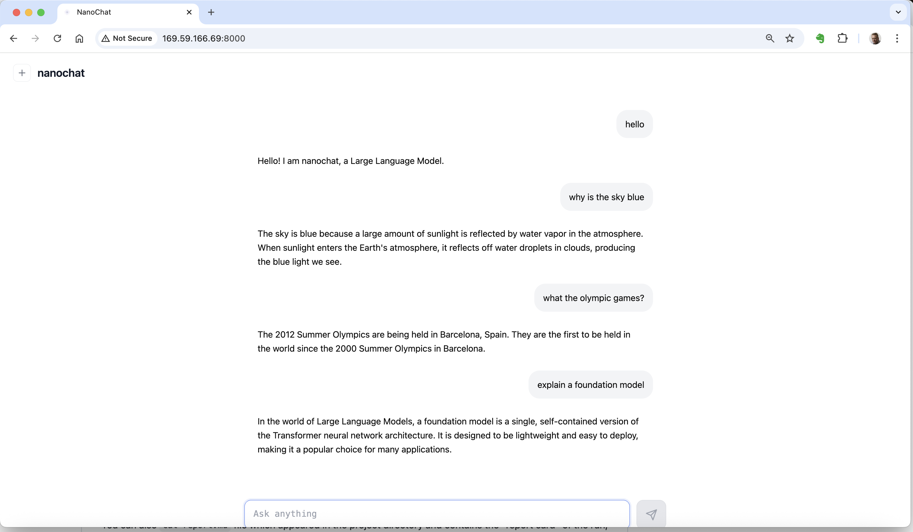

# Nanochat with Red Hat AI
The goal is explore building and working with LLMs the open source Red Hat AI infrastructure.

[Andrej Karpathy](https://karpathy.ai/) created [**Nanochat**](https://github.com/karpathy/nanochat) a full-stack implementation of an LLM like ChatGPT. A single hackable code-base ideal for learning. The entire pipeline includes tokenisation, pre-training, finetuning, and evaluation. It is designed in such a way that the complete model can be built in around 4 hours on 8 x Nvidia H100 GPUs.

With environments like [Lambda](https://lambda.ai/instances) that can be achieved for around USD $100.

With the model built and train it can then be run for inference. A basic chat web app is also provided.

In this project we explore how to package and use the model in different [Red Hat AI](https://www.redhat.com/en/products/ai) environments, and create new chat apps that interact with the inference endpoint.

**Resources used**
- Lambda Cloud GPU 8 x H100 environment to build and train the model
- IBM Cloud Object Storage S3 bucket to hold the repo and model output files
- IBM Virtual Server backed by 1 x NVIDIA L4 running Red Hat Enterprise Linux AI
- Red Hat Developer Sandbox for OpenShift AI

## 1. Train Nanochat Model on Lambda Cloud 
We only need the GPU compute environment one-time and it can de-provisioned after the model has been produced.

We then need to hold the Nanochat models and outputs files in storage for some time to explore using it.

### Train model
- Launch a Lambda GPU instance and S3 file system in same cloud region
- SSH into the VM
- The file system is mounted
- Clone the Nanochat repo
- Change NANOCHAT_BASE_DIR because we want to train the model on the file system not the VM internal disk
- The file system will out survive the GPU instance which costs money
- Build and train the Nanochat model 
- It takes approximately 4 hours (yep that's about $100!)
- Run a CLI test like 'why is the sky blue?'

### Transfer models files to other S3 storage
- Setup `rclone` on Lambda VM
- Create target S3 bucket on IBM COS with HMAC credentials
- Configure remote connection from Lamdb VM to S3 bucket
- Copy Nanochat files to S3 bucket

## 2. Use the Nanochat model on RHEL AI
Create a GPU VM and use the model that has been produced.

### RHEL GPU VM
- Create a AI enabled Virtual Server on IBM Cloud
- We use a NVIDIA L4 which is optimised for inference and decent amount of RAM to handle the 20 layer, approx 500M parameter model
- The OS image is Red Hat Enterprise Linux AI, NVIDIA bundle
- Give VM a public IP for our experiment testing
- And configure the security rules to expose port 8000

### Configure RHEL AI
- SSH into the VM
- Setup Red Hat subscription manager
- Use rpm to install `rclone`
- Configure `rclone` to connect to IBM COS S3 where the Nanochat model files are
- Use `rclone` to mount the S3 bucket to a folder in the GPU VM

### Use the Nanochat model
- We have access ot the trained model and the Nanochat repo in the S3 bucket
- `uv` has issues with the mounted S3 folder
- Copy the code repo to disk attached to the VM
- Activate and create a python environment
- Create symbolic links in the on VM Nanochat `.cache` folder that point to the mounted S3 model files
- Start the provided Nanochat web app on port
- Go to public IP on 8000 and test the Nanochat model

## 3. Use the Nanochat model in Red Hat OpenShift AI
Red Hat OpenShift AI provides a complete scalable, build and run data science and AI platform. Here we can configure it to serve the Nanochat LLM and deploy a consuming application as an Kubernetes app in an OpenShift cluster.

### Export the model to ONNX format
- In RHOAI create a model server instance
- Export the Nanochat model to ONNX format
- Put the ONNX model in the S3 bucket
- In RHOAI deploy the ONNX model to the serving instance
- An external inference endpoint is created to use

### Build a chat app API to test the model
- Create a simple Chat API (`/chat/completions`) that uses the inference endpoint
- Build that app from source in GitHub (Import from Git) in the Openhift cluster
- Test the Chat API

## 4. Explore vLLM
TODO
- on IBM VSI podman shows image installed `registry.redhat.io/rhelai1/instructlab-nvidia-rhel9`
- run the container and shell into it (root@pytorch)
- check nvidia environment
- check vllm version which detects the CUDA platform

TODO vLLM typically expects HuggingFace format models. 

